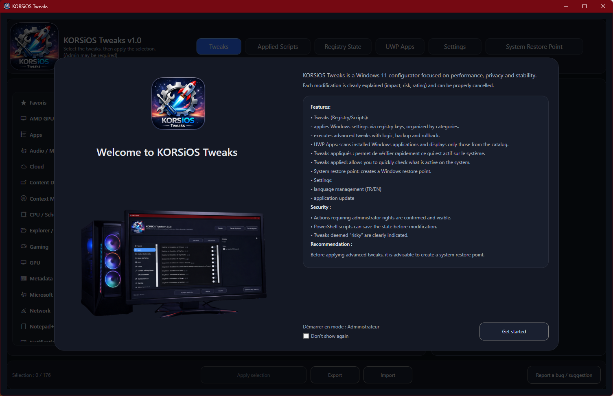
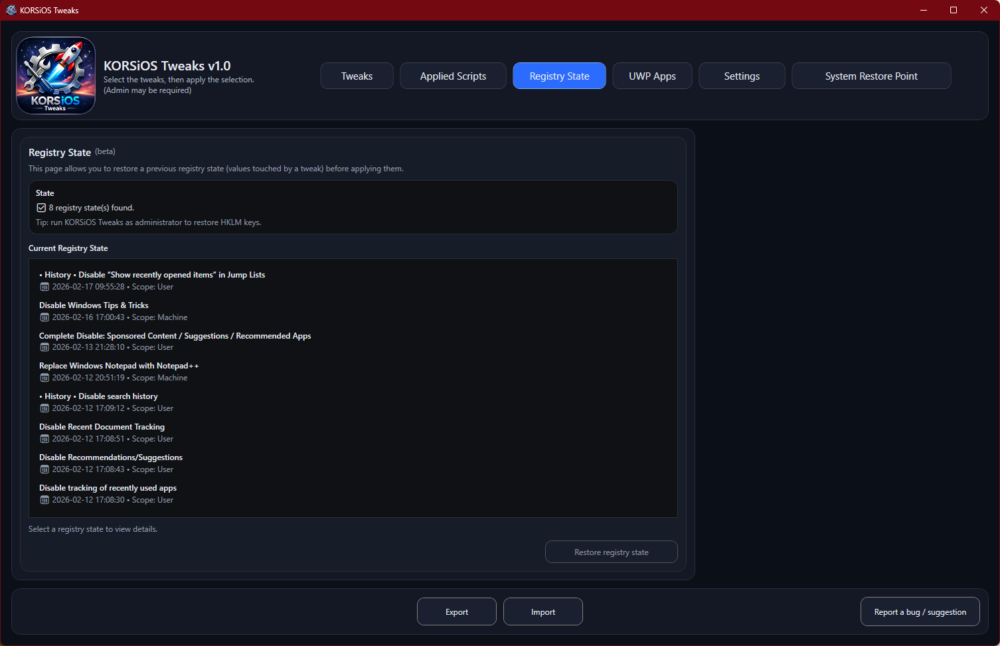
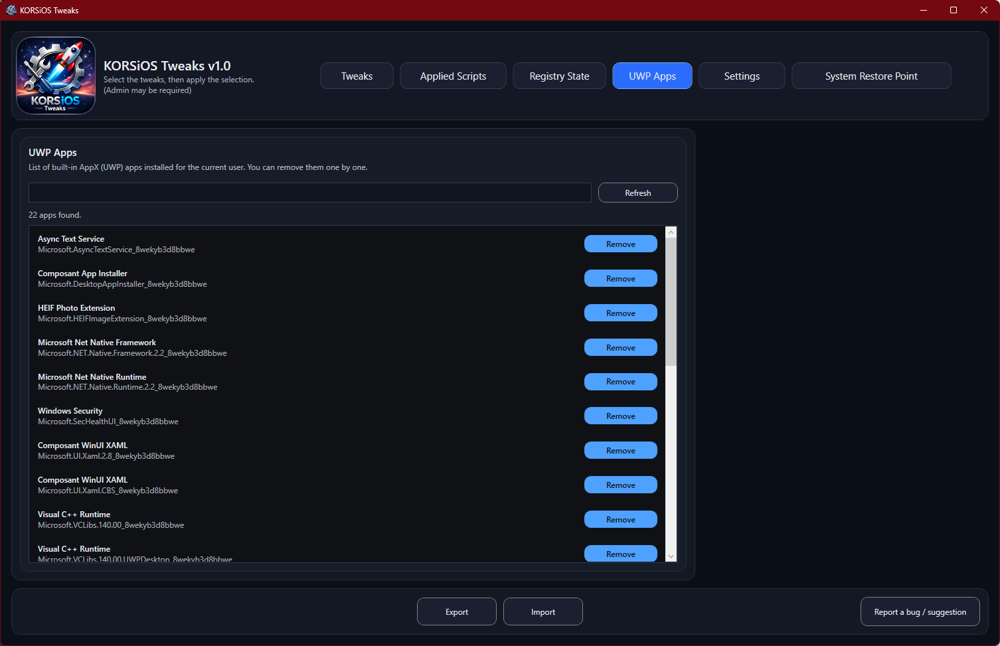
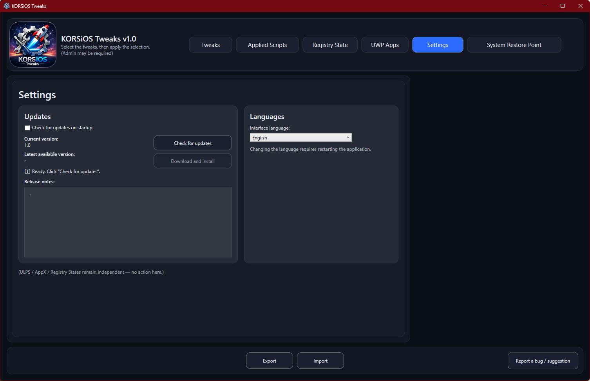
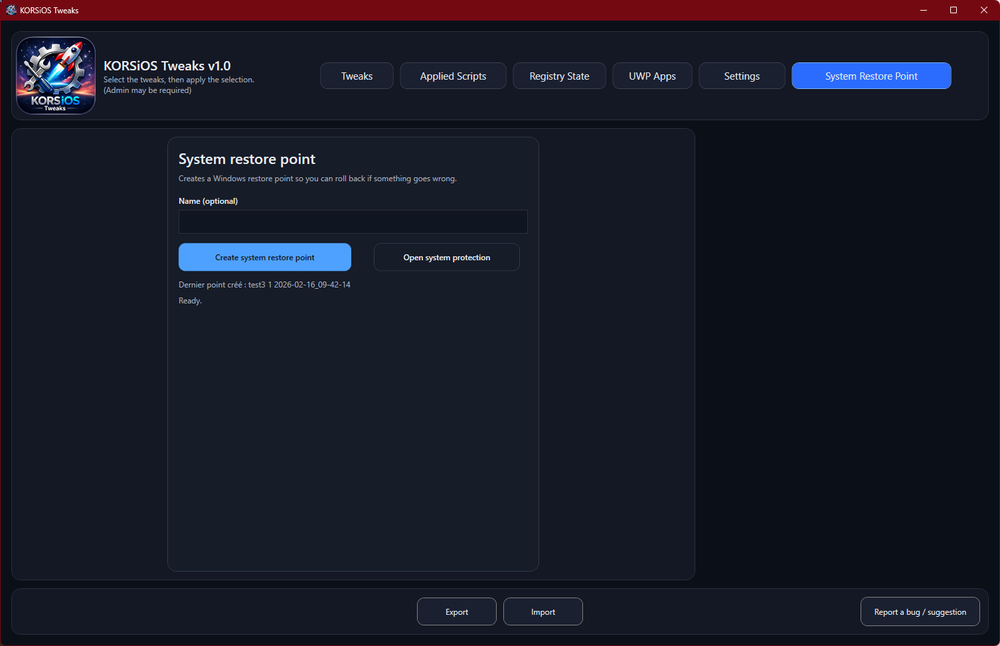

# 🧩 KORSiOS Tweaks
 

  <strong>🇬🇧 English</strong> | <a href="README.md">🇫🇷 Français</a>

  

  
 
 
 
 
 
 
 
 
 
 

  
### KORSiOS Tweaks is an advanced Windows configuration and optimization tool.

### Designed to quickly and cleanly apply targeted system tweaks (registry, Windows features, components, system behaviors).  

## 🖥️ Interface Preview

The project focuses on :

- **stability**
- **readability of actions**
- **reversibility**
- and a **clear user experience**, even for advanced tweaks.

---

## ✨ Main Features

### ⚙️ System Tweaks
  - Organized by category: Power, Taskbar, File Explorer, Performance, etc.
  - Tweaks are executed in two different ways: Registry .reg or Scripts .ps1 

A dedicated **Details** block for each tweak displays:
  - Description
  - Expected impact
  - Potential risks
  - Important notes 

So you know exactly what it does and what it offers before you commit.

### 💾 Applied Scripts / Registry State 
Allows you to restore previous values ​​(before applying the tweak(s))
  - **Applied Scripts**: restores tweaks Scripts (.ps1)
  - **Registry State**: restores tweaks Regist (.reg)

### 🧠 UWP Apps 
Allows you to remove UWP Apps present in the OS
  - Click the **Refresh** button to scan the apps
  - Once loaded, you can delete them

### 🛠️ Settings
  - Allows you to update the app when a new one is available (checking at launch is possible)
  - Allows you to change the app language (Fr/En)

### ↩️ **Integrated System Restore Point Creation**
  - Create a system restore point before any changes
  - Displays the last restore point created from the application

### 🖥️ **Interface Modern graphical interface**
  - Simple, readable, and efficiency-oriented

### 🔒 **No silent modifications**
  - The user retains complete control
  - No tweaks are applied without explicit action

---

## 🚀 Installation

1. Go to **Releases**
2. Download the **latest stable version**
3. Run the installer (French/English)
4. Run **KORSiOS Tweaks** in **Administrator** mode

> ⚠️ **Administrator rights required**

> Some system modifications require elevated privileges.

---

## 🔄 Updates

- Updates are distributed via **GitHub Releases**
- Each version is:
  - tested
  - versioned
  - accompanied by a clear changelog

---

## ⚠️ Important Warning

KORSiOS Tweaks modifies advanced Windows settings.

- Some options may :
  - affect stability
  - change system behavior
  - disable Windows features
  - Use of the software is **at your own risk**

👉 **It is strongly recommended to:**

- create a system restore point
- back up your important data
- carefully read the tweak descriptions before applying

---

## 📌 Support & Feedback

- 🐞 A bug?

- 💡 A suggestion?

- ❓ A question?

👉 Use the **Report a bug/suggestion** button from within the application:

- Click the **Report a bug/suggestion** button
- Confirm the pop-up
- A window will open providing access to the **BugReport_XXXXXXXX.zip** file
- To **report a bug**, upload the **BugReport_XXXXXXXX.zip** file to Drive/OneDrive/WeTransfer, etc.

- Copy the link at the bottom of the form
- Submit the request

---

## 👤 Author

Developed by **KORSiRO**
Personal project focused on performance, system mastery, and Windows optimization.

---

## ⭐ Thanks

Thank you to everyone who tests, reports bugs, and contributes to improving the stability and quality of KORSiOS Tweaks.
