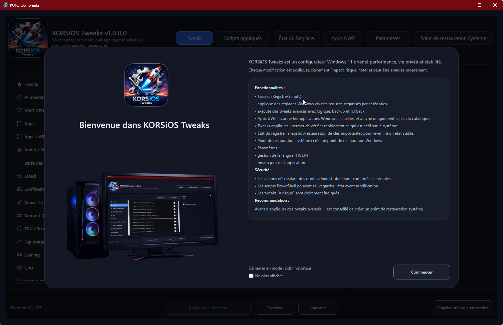
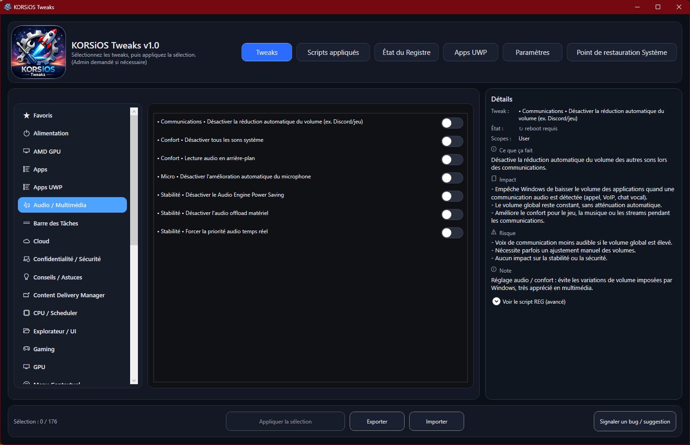
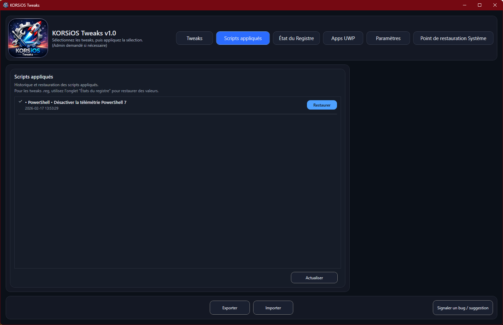
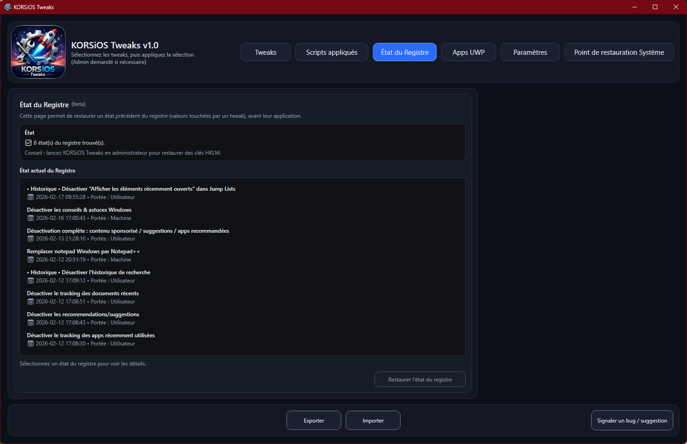
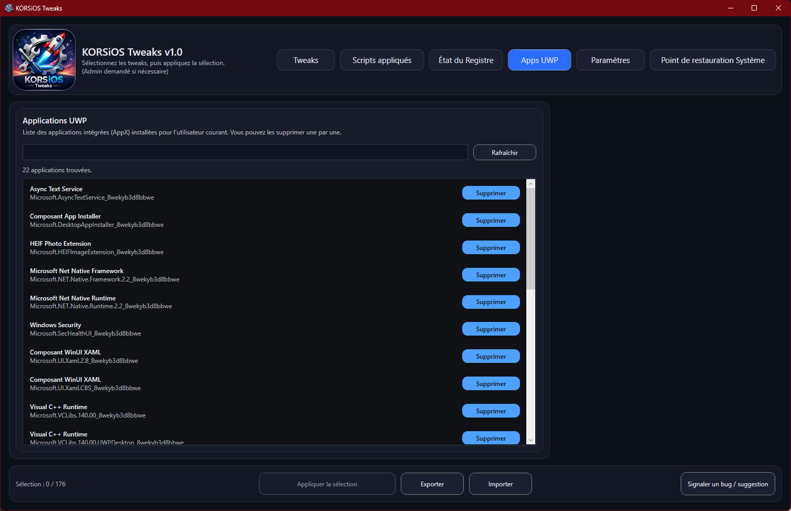
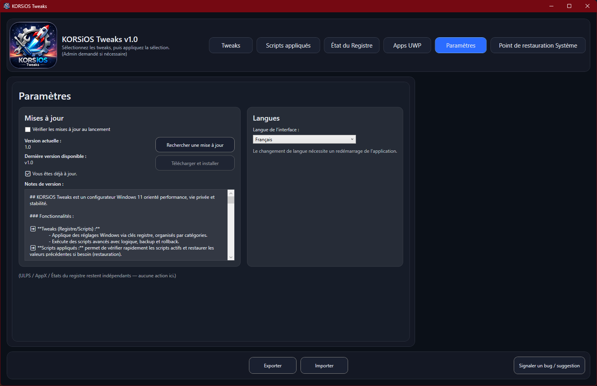
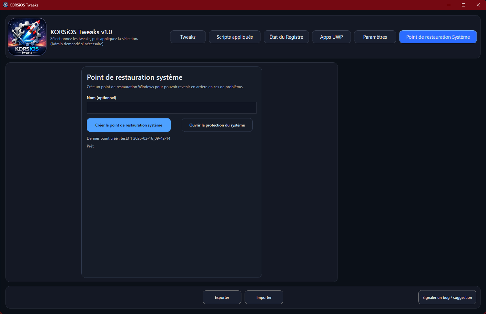

# 🧩 KORSiOS Tweaks
 

  <strong>🇫🇷 Français</strong> | <a href="README.en.md">🇬🇧 English</a>

  

            

  
### KORSiOS Tweaks est un outil Windows de configuration et d’optimisation avancée.
### Conçu pour appliquer rapidement et proprement des réglages système ciblés (registre, fonctionnalités Windows, composants, comportements système).  

## 🖥️ Aperçu de l’interface

Le projet met l’accent sur :
- la **stabilité**
- la **lisibilité des actions**
- la **réversibilité**
- et une **expérience utilisateur claire**, même pour des tweaks avancés.

---

## ✨ Fonctionnalités principales

### ⚙️ Tweaks système
 - Organisés par catégories : Alimentation, Barre des Tâches, Explorateur, Performance etc.
 - Les tweaks sont exécutés de deux façons différentes : Registre .reg ou Scripts .ps1 

Un bloc **Détails** dédié pour chaque tweak permet d'afficher :
  - Description
  - Impact attendu
  - Risques potentiels
  - Notes importantes 

Afin de savoir exactement sont utilité et ce qu'il apporte avant validation.

### 💾 Scripts appliqués / État du registre 
Permet de réaliser une restauration des valeurs précédentes (avant application du/des tweaks)
  - **Scripts appliqués** : restauration des tweaks Scripts (.ps1)
  - **État du registre** : restauration des tweaks Registe (.reg)

### 🧠 Apps UWP 
Permet de supprimer les Applications UWP présentes dans l'OS
  - Cliquez sur le bouton **Rafraîchir** pour analyser les applications
  - Une fois chargées, vous pouvez les supprimer

### 🛠️ Paramètres
  - Permet d'effectuer la mise à jour de l'application quand une nouvelle est disponible (vérification au lancement possible)
  - Permet de modifier la langue de l'application (Fr/En)
 
### ↩️ **Création de point de restauration système directement intégré**
  - Créez un point de restauration système avant toutes modifications
  - Affiche le dernier point de restauration créé depuis l'application

### 🖥️ **Interface graphique moderne**
  - Simple, lisible et orientée efficacité

### 🔒 **Aucune modification silencieuse**
  - L’utilisateur garde le contrôle total
  - Aucun tweak n’est appliqué sans action explicite

---

## 🚀 Installation

1. Rendez-vous dans les **Releases**
2. Téléchargez la **dernière version stable**
3. Lancez l’installateur (Fr/En)
4. Lancez **KORSiOS Tweaks** en mode **Administrateur**

> ⚠️ **Droits administrateur requis**  
> Certaines modifications système nécessitent des privilèges élevés.

---

## 🔄 Mises à jour

- Les mises à jour sont distribuées via les **Releases GitHub**
- Chaque version est :
  - testée
  - versionnée
  - accompagnée d’un changelog clair

---

## ⚠️ Avertissement important

KORSiOS Tweaks modifie des paramètres avancés de Windows.

- Certaines options peuvent :
  - affecter la stabilité
  - modifier le comportement du système
  - désactiver des fonctionnalités Windows
- L’utilisation du logiciel se fait **à vos propres risques**

👉 **Il est fortement recommandé de :**
- créer un point de restauration système
- sauvegarder vos données importantes
- lire attentivement les descriptions des tweaks avant application

---

## 📌 Support & retours

- 🐞 Un bug ?
- 💡 Une suggestion ?
- ❓ Une question ?

👉 Utilisez le bouton **Signaler un bug/suggestion** depuis l'application :
- Cliquez sur le bouton **Signaler un bug/suggestion**
- Validez la pop-up
- Une fenêtre s'ouvre pour donner accès au fichier **BugReport_XXXXXXXX.zip**
- Pour **signaler un bug**, uploader le fichier **BugReport_XXXXXXXX.zip sur Drive/OneDrive/Wetransfer etc.
- Copiez le lien en bas du formulaire
- Envoyez la demande

---

## 👤 Auteur

Développé par **KORSiRO**  
Projet personnel axé performance, maîtrise système et optimisation Windows.

---

## ⭐ Remerciements

Merci à toutes les personnes qui testent, remontent des bugs et contribuent à améliorer la stabilité et la qualité de KORSiOS Tweaks.
